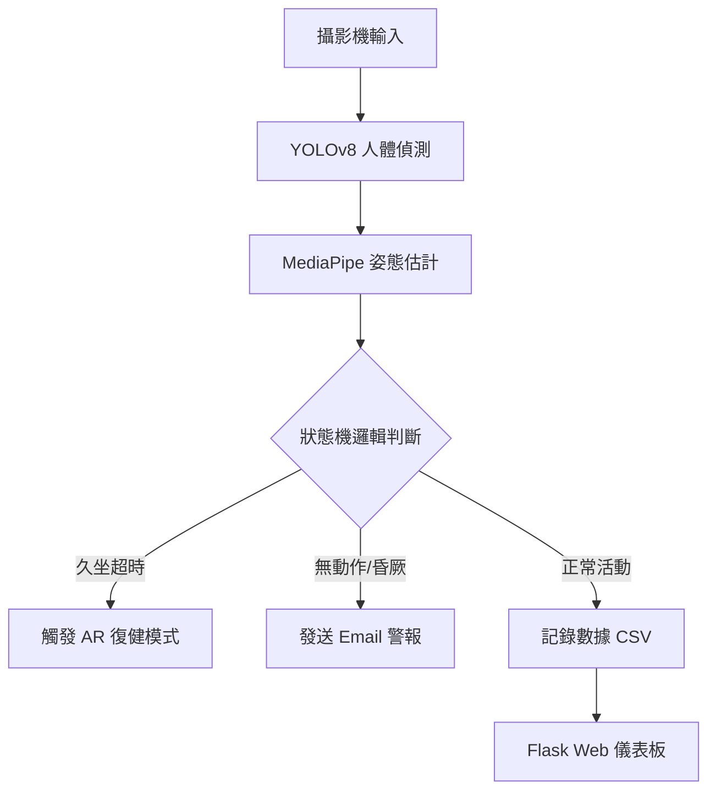

# Smart Care: 銀髮族久坐與復健照護系統

一個結合電腦視覺與物聯網概念的智能照護系統，整合 YOLO 物體偵測與 MediaPipe 姿態估計技術，用於監測長者久坐狀況、提供 AR 復健遊戲，並在緊急狀況發生時發送警報。

## 功能特點

* 🧘 **姿態識別與分析**：結合 YOLOv8 (人體偵測) 與 MediaPipe (骨架分析)，精準判斷「坐姿」與「站姿」，並計算膝蓋與臀部角度。
* ⏱️ **久坐提醒監控**：即時追蹤坐姿持續時間，超過設定閥值即發出語音警報，引導進行活動。
* 🎮 **AR 體感復健遊戲**：內建互動式復健模式，使用者需透過肢體動作觸碰螢幕上的虛擬目標，完成指定次數才算達成復健。
* 🚨 **緊急狀態偵測**：監測長時間無反應（昏厥疑慮）或復健未完成狀況，自動發送 Email 通知照護者。
* 📉 **即時平衡評估**：分析站立時肩膀的晃動程度，計算平衡分數並給予評級（Excellent/Fair/Poor）。
* 💻 **Web 儀表板**：基於 Flask 的網頁介面，提供即時影像串流、歷史數據圖表、以及遠端控制功能（如隱私模式、睡眠模式）。

## 系統架構



## 環境需求

* Python 3.8+
* Web Browser (用於監控儀表板)
* 網路連接 (用於發送 Email)

## 安裝

1. **安裝依賴套件**
```bash
pip install opencv-python mediapipe pygame numpy flask ultralytics

```


2. **準備音效檔案 (可選)**
請將以下 mp3 檔案放置於專案根目錄：
* `up.mp3` - 久坐警報音
* `success.mp3` - 復健成功音效
* `start.mp3` - 復健開始音效
* `emergency.mp3` - 緊急警報音效


3. **配置 Email (關鍵)**
修改程式碼中的 Email 設定區塊，填入您的 Gmail 與應用程式密碼：
```python
SENDER_EMAIL = "your_email@gmail.com"
SENDER_PASSWORD = "your_app_password"
RECEIVER_EMAIL = "caregiver_email@gmail.com"

```


## 使用方法

### 啟動系統

直接執行 Python 腳本：

```bash
python sittingokayge.py

```

### 系統操作

1. **初始化校正**：系統啟動後，使用者需在鏡頭前**站立**約數秒，待系統顯示 "System Ready" 即完成身高與姿態校正。
2. **網頁監控**：打開瀏覽器訪問 `http://localhost:5000` (或局域網 IP)，即可查看即時畫面與數據。
3. **互動控制**：透過網頁介面可開關「隱私模式 (模糊人臉)」、「睡眠模式」或執行「系統重置」。

## 配置說明

主要參數位於程式碼開頭的 **使用者設定區**，可根據需求調整：

### 主要配置項

```python
# 硬體與路徑
VIDEO_SOURCE = 0          # 攝影機編號 (0 為預設鏡頭)
CSV_FILE = ".../log.csv"  # 數據日誌儲存路徑

# 偵測參數
YOLO_MODEL = "yolov8n.pt" # 使用的 YOLO 模型
YOLO_CONF = 0.60          # YOLO 信心度閾值
ALERT_INTERVAL = 10.0     # 久坐警告觸發時間 (秒，測試用建議短，實際使用可設長)

# 安全參數
UNCONSCIOUS_TIME_THRESHOLD = 60.0  # 無動作視為昏厥的秒數
WAIT_FOR_STAND_TIMEOUT = 30.0      # 復健模式下等待站立的超時秒數

```

## 輸出說明

### 網頁儀表板 (Web Dashboard)

* **即時監控畫面**：疊加骨架、狀態標籤與 AR 遊戲物件。
* **數據卡片**：今日起立次數、累積久坐時間、最長久坐時間、平衡分數。
* **圖表分析**：
* 📊 **今日 24 小時分佈**：每小時的久坐趨勢。
* 📈 **歷史每日總久坐**：過去 7 天的數據變化。


### CSV 數據日誌

系統會自動生成兩個 CSV 檔案：

1. **`*_log_events.csv`**：記錄每日總結數據（起立次數、總時間）。
2. **`*_log_events_events.csv`**：記錄每一次久坐事件的詳細起訖時間與持續長度。

### Email 警報內容

當偵測到緊急狀況 (Emergency) 時，系統會發送 HTML 格式郵件：

> **主旨**：⚠️ [緊急警報] 偵測到長輩長時間無反應！
> **內容**：包含發生時間與紅色警示文字，通知照護者立即確認。

## 技術細節

### 使用的模型與演算法

* **YOLOv8**：用於初步鎖定畫面中的人物 (ROI)，並支援多目標過濾，選取畫面中最大的人物作為主要監測對象。
* **MediaPipe Pose**：在 YOLO 鎖定的區域內進行高精度的 33點骨架關鍵點檢測。
* **幾何角度計算**：
* 利用 3D 座標計算膝蓋 (Hip-Knee-Ankle) 與臀部 (Shoulder-Hip-Knee) 角度。
* 結合大腿與軀幹的比例 (Ratio) 來輔助判斷坐/站狀態。


* **粒子特效系統**：程式碼內建 Python 類別 `FireworkParticle`，用於繪製復健成功時的煙火慶祝特效。

### 處理流程

1. **YOLO 偵測**：獲取人物 Bounding Box。
2. **ROI 擴展與裁切**：確保骨架偵測穩定。
3. **姿態平滑化**：使用 `PoseSmoother` 減少骨架抖動。
4. **狀態機判定**：Sitting -> (Time > Limit) -> Rehab Mode -> (Stand Up & Touch Targets) -> Success/Reset。

## 常見問題

**Q: 為什麼系統一直顯示 "Please STAND to Calibrate"?**
A: 系統需要基準身高來判斷後續的坐姿。請確保全身（至少上半身與膝蓋）在鏡頭內，並保持站立姿勢直到上方出現綠色 "System Ready"。

**Q: 復健遊戲無法觸發目標？**
A: 遊戲判定是基於手腕關鍵點 (Wrist Landmarks) 與虛擬座標的距離。請確保揮手動作幅度足夠大，且手腕清楚被鏡頭捕捉。

**Q: 如何關閉網頁上的警報音效？**
A: 網頁儀表板上有一個「網頁音效」按鈕，點擊即可切換開啟或靜音；伺服器端(電腦本機)的音效則需透過修改程式碼或系統音量控制。

**Q: 隱私模式是什麼？**
A: 開啟後，系統會自動偵測臉部關鍵點區域，並對該區域進行高斯模糊處理 (Gaussian Blur)，保護使用者隱私。
